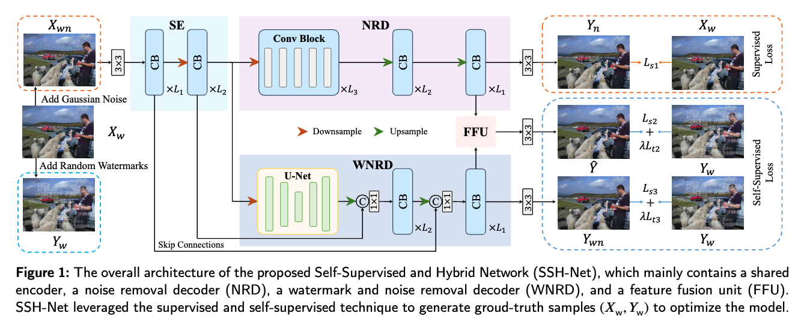
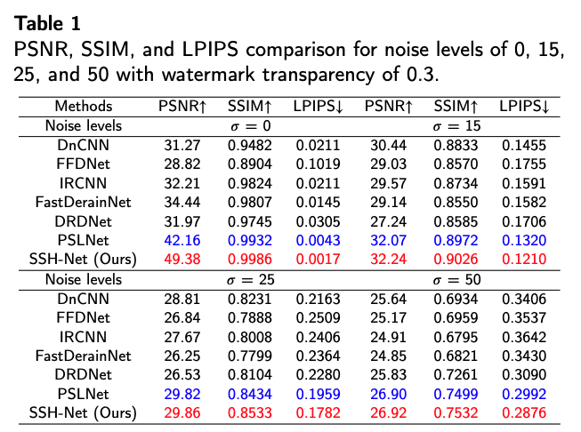
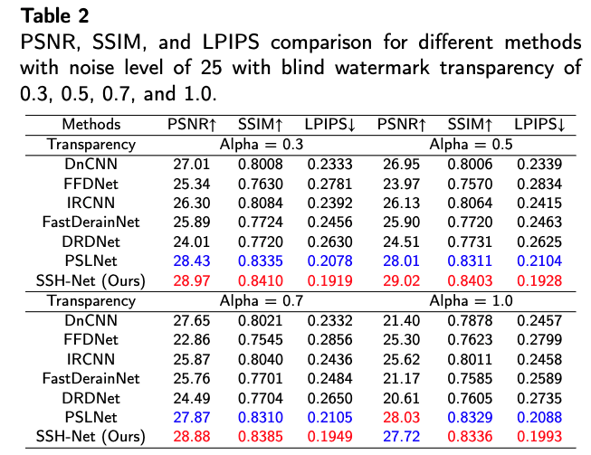

## SSH-Net: A Self-Supervised and Hybrid Network for Noisy Image Watermark Removal

Official PyTorch implementation of our paper accepted at the *Journal of Visual Communication and Image Representation (JVCI)*:

> **Wenyang Liu¹, Jianjun Gao¹, and Kim-Hui Yap¹***  
> ¹ Nanyang Technological University, Singapore


## 📝 Abstract
Visible watermark removal is challenging due to its inherent complexities and the noise carried within images. Existing methods primarily rely on supervised learning approaches that require paired datasets of watermarked and watermark-free images, which are often impractical to obtain in real-world scenarios. To address this challenge, we propose SSH-Net, a Self-Supervised and Hybrid Network specifically designed for noisy image watermark removal. SSH-Net synthesizes reference watermark-free images using the watermark distribution in a self-supervised manner and adopts a dual-network design to address the task. The upper network, focused on the simpler task of noise removal, employs a lightweight CNN-based architecture, while the lower network, designed to handle the more complex task of simultaneously removing watermarks and noise, incorporates Transformer blocks to model long-range dependencies and capture intricate image features. To enhance the model’s effectiveness, a shared CNN-based feature encoder is introduced before dual networks to extract common features that both networks can leverage. Comprehensive experiments show that our proposed method surpasses state-of-the-art approaches in both performance and efficiency, demonstrating its effectiveness in noisy image watermark removal.

## 🧩 Requirements (PyTorch)

* pytorch==1.11.0
* tensorboard==2.9.1
* scikit-image==0.19.3
* pyyaml==5.1
* h5py==3.7.0
* opencv-python==4.6.0
* matplotlib==3.5.2

## 📁 Dataset

The datasets used in our experiments can be obtained from the [PSLNet repository](https://github.com/hellloxiaotian/PSLNet). 

## 🛠️ Command

### Test

python test_noisy.py --net SSHNet --mode [B/S] --mode_wm [B/S] --test_noiseL [0/15/25/50] --alphaL [0.3/0.5/0.7/1.0] --loss L1 --self_supervised True --display False

### Train

python train_noisy.py --net SSHNet --noiseL 25 --mode_wm S --alpha 0.3 --loss L1 --self_supervised True --display False

mode：trained with blind noise [B] or not [S]

mode_wm：trained with blind watermarks [B] or not [S]

test_noiseL：noise levels [0/15/25/50]

alphaL：watermark transparency[0.3/0.5/0.7/1.0] 

## 1. Network architecture of SSHNet.



## 2. Average PSNR(dB), SSIM and LPIPS of different methods for noise level of 0, 15, 25 and 50 with watermark transparency of 0.3.  

<p align="center">
  
</p>


## 3. Average PSNR(dB), SSIM and LPIPS of different methods for noise level of 25 with watermark transparency of 0.3, 0.5, 0.7 and 1.0. 

<p align="center">
  
</p>


## 🙏 Acknowledgement

Some parts of our code are adapted from the excellent implementations of:

- [**PSLNet**](https://github.com/hellloxiaotian/PSLNet)  
- [**Restormer**](https://github.com/swz30/Restormer)

We sincerely thank the authors for open-sourcing their work, which greatly facilitated our development.


## 📖 Citation

If you find this work helpful, please consider citing our paper:

### 🔹 SSH-Net (JVCI 2025)

```bibtex
@article{LIU2025104516,
  title     = {SSH-Net: A self-supervised and hybrid network for noisy image watermark removal},
  author    = {Wenyang Liu and Jianjun Gao and Kim-Hui Yap},
  journal   = {Journal of Visual Communication and Image Representation},
  volume    = {in press},
  pages     = {104516},
  year      = {2025},
  issn      = {1047-3203},
  doi       = {https://doi.org/10.1016/j.jvcir.2025.104516},
  keywords  = {Self-supervised learning, Noisy image watermark removal, Vision Transformer}
}